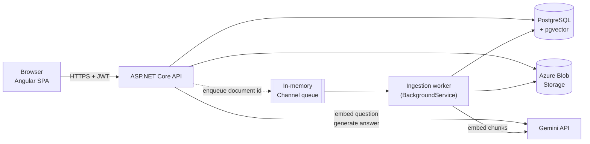

# Document Assistant

Upload your own documents and ask questions about them. Answers are generated **only from your files** and come with **citations** pointing back to the passage (and PDF page) they were drawn from.

**Live demo:** https://document-assistant-kero.vercel.app/

A full-stack retrieval-augmented generation (RAG) app: an Angular frontend, an ASP.NET Core API, PostgreSQL with `pgvector` for semantic search, and Google Gemini for embeddings and answer generation.

<!-- Add a screenshot or GIF of upload -> ask -> citations here, e.g.  -->

---

## Features

- **Accounts:** register and log in with email and password (ASP.NET Core Identity + JWT).
- **Document upload:** PDF, DOCX, Markdown, and plain text, up to 20 MB each and 50 documents per user.
- **Background indexing:** uploads return immediately. A background worker extracts text, chunks it, embeds it, and stores the vectors. The UI polls and shows each document as `Pending`, `Processing`, `Ready`, or `Failed` (with the reason).
- **Grounded Q&A:** questions are answered from the user's own documents, with a citation (file, page for PDFs, snippet) for every passage used.
- **Honest refusals:** if nothing relevant is found, the app says so instead of guessing, and skips the model call entirely.
- **Document management:** list, download the original file, and delete (which also removes its chunks and stored file).
- **Private by design:** every query is scoped to the signed-in user, and another user's document looks identical to a missing one.
- **Abuse protection:** per-user rate limits on uploads and questions, size and count caps, and a global error handler that never leaks stack traces.

## Tech stack

| Layer           | Technology                                                                                               |
| --------------- | -------------------------------------------------------------------------------------------------------- |
| Frontend        | Angular 22 (standalone components, signals), TypeScript 6, Tailwind CSS v4, Vitest                       |
| Backend         | ASP.NET Core minimal API on .NET 10, EF Core 10, FluentValidation, Scrutor                               |
| Auth            | ASP.NET Core Identity, JWT bearer tokens                                                                 |
| Database        | PostgreSQL with the `pgvector` extension (`vector(1536)` column)                                         |
| File storage    | Azure Blob Storage (Azurite for local development)                                                       |
| AI              | Google Gemini: `gemini-embedding-001` for embeddings, `gemini-3.8-flash` for answers (both configurable) |
| Text extraction | PdfPig (PDF), DocumentFormat.OpenXml (DOCX), UTF-8 read (MD/TXT)                                         |
| Hosting         | Vercel (frontend), MonsterASP.NET (API), GitHub Actions for deployment                                   |

## Architecture



### Ingestion pipeline (upload to searchable)

1. `POST /api/documents` validates the file, writes it to blob storage under `{userId}/{documentId}{ext}` (the client's file name never touches the path), saves a `Documents` row as `Pending`, and enqueues the id.
2. The worker picks it up, sets `Processing`, and runs **extract, chunk, embed, store**:
   - **Extract:** one extractor per format, picked by extension. PDFs yield one segment per page so page numbers survive; scanned PDFs with no text layer fail with a clear message (OCR is out of scope).
   - **Chunk:** about 1000 characters with 200 overlap, preferring paragraph, then sentence, then word boundaries. Each page is chunked separately, so a chunk never straddles two pages.
   - **Embed:** chunks are sent to Gemini in batches of 64 with the `RETRIEVAL_DOCUMENT` task type.
   - **Store:** one `DocumentChunks` row per chunk, with its text, page number, and vector.
3. The document becomes `Ready` (or `Failed` with a user-safe reason). Each document runs in its own try/catch, so one bad file can't stop the worker. On startup, anything left `Pending` or `Processing` by a crash is re-queued.

### Question answering

1. If the user has no `Ready` documents, return a "no documents yet" result without calling any model.
2. Embed the question with the `RETRIEVAL_QUERY` task type.
3. Retrieve the nearest chunks by cosine distance (`<=>`), filtered by user id on both the chunk and its document, `Ready` documents only. Top 5 by default.
4. Drop chunks below the similarity threshold (0.5 by default). If none remain, answer "I don't know" and skip the model.
5. Send the surviving chunks to Gemini with a grounding system prompt: answer only from the context, admit ignorance otherwise, and treat document text as data, never as instructions (a prompt-injection guard).
6. Return the answer plus citations built from the chunks that were actually used.

The three outcomes (`Answered`, `NoDocuments`, `NoRelevantContext`) all return `200`; the `outcome` field tells the UI which panel to show.

### Design decisions

- **Vertical slices with lightweight CQRS.** Each use case lives in one file (`Features/<Area>/<UseCase>.cs`) with its command or query, validator, handler, and endpoint. Endpoints and handlers are discovered by reflection and Scrutor, so adding a feature never touches `Program.cs`.
- **pgvector instead of a separate vector database.** One datastore, plain SQL, and user scoping is just a `WHERE` clause.
- **Gemini over REST, no SDK.** `batchEmbedContents` and `generateContent` are called directly, so there is no SDK version to track against the framework.
- **1536-dimension vectors.** `gemini-embedding-001` natively returns 3072 dimensions; the app requests 1536 and L2-normalizes the result (Gemini only returns normalized vectors at full width). This halves storage and comparison cost. Truncation lowers cosine scores, so the 0.5 similarity threshold is deliberately a low floor for "obviously unrelated"; ranking is done by top-K.
- **Async ingestion over an in-memory `Channel`.** Simple and dependency-free. The database is the source of truth, and the startup re-queue covers restarts.
- **Polling instead of push.** The client polls the document list only while something is `Pending` or `Processing`, then stops.
- **Fail fast on configuration.** Missing secrets, a short JWT key, or a failed migration stop the app at startup rather than letting it serve a half-working API.

## Security

- JWT bearer auth with a 60-minute lifetime (configurable), a minimum 32-byte signing key, and a 30-second clock skew.
- The user id always comes from the token, never from the URL or request body.
- Per-user fixed-window rate limits (client IP for anonymous callers): **5 questions per 5 minutes** and **5 uploads per hour** by default. Rejections return `429` with `Retry-After`.
- Upload limits: 20 MB per file, an extension allow-list (`.pdf`, `.docx`, `.md`, `.txt`), 50 documents per user, and cleanup of the stored file if the database write fails.
- Gemini API key is sent in a header, not the query string, and provider error bodies are logged only in Development.
- Every request gets a correlation id (`X-Correlation-Id`), echoed in responses and in the `traceId` of error bodies. Server errors return generic messages; stack traces stay in the logs.

## API

All routes except register, login, and health require `Authorization: Bearer <token>`. Errors use RFC 7807 `ProblemDetails`.

| Method   | Route                          | Description                                                       |
| -------- | ------------------------------ | ----------------------------------------------------------------- |
| `POST`   | `/api/auth/register`           | Create an account, returns a token                                |
| `POST`   | `/api/auth/login`              | Log in, returns a token (`401` on bad credentials)                |
| `GET`    | `/api/me`                      | Current user                                                      |
| `GET`    | `/api/documents`               | List the user's documents, newest first, with status              |
| `POST`   | `/api/documents`               | Upload a file (`multipart/form-data`, field `file`), rate limited |
| `GET`    | `/api/documents/{id}/download` | Download the original file                                        |
| `DELETE` | `/api/documents/{id}`          | Delete the document, its chunks, and its stored file              |
| `POST`   | `/api/questions`               | Ask a question, rate limited                                      |
| `GET`    | `/health`                      | Health check (JSON, `503` when unhealthy)                         |

Example question response:

```json
{
  "isAnswerable": true,
  "outcome": "Answered",
  "answer": "Employees receive 10 paid sick days per year.",
  "citations": [
    {
      "documentId": "3f1c...",
      "fileName": "employee-handbook.pdf",
      "pageNumber": 2,
      "snippet": "Every employee receives 10 paid sick days per year, regardless of how long they have..."
    }
  ]
}
```

`pageNumber` is `null` for formats without pages (DOCX, MD, TXT). A provider failure or timeout returns `502`.

## Data model

- **Documents:** `Id`, `UserId`, `FileName`, `ContentType`, `SizeInBytes`, `BlobName`, `UploadedAtUtc`, `Status` (`Pending | Processing | Ready | Failed`), `ErrorMessage`.
- **DocumentChunks:** `Id`, `DocumentId` (cascade delete), `UserId`, `ChunkIndex`, `Content`, `PageNumber` (nullable), `Embedding` (`vector(1536)`).
- Users, roles, and claims use the standard ASP.NET Core Identity tables.

## Getting started

### Prerequisites

- [.NET 10 SDK](https://dotnet.microsoft.com/download)
- [Node.js](https://nodejs.org/) 24 and npm
- PostgreSQL **with the `pgvector` extension available** on the server (the first migration runs `CREATE EXTENSION vector`). A hosted Postgres that supports pgvector works too.
- Azure Blob Storage, or the [Azurite](https://learn.microsoft.com/azure/storage/common/storage-use-azurite) emulator for local development
- A Gemini API key from [Google AI Studio](https://aistudio.google.com/apikey)

### 1. Clone

```bash
git clone https://github.com/kerolos-n/DocumentAssistant.git
cd DocumentAssistant
```

### 2. Run the API

```bash
cd server
cp .env.example .env     # then edit .env
```

Fill in `server/.env` (the file is gitignored). The connection string key must be `ConnectionStrings__DefaultConnection`:

```env
ASPNETCORE_ENVIRONMENT=Development
ASPNETCORE_URLS=http://localhost:3000

ConnectionStrings__DefaultConnection="Host=localhost;Port=5432;Database=document-assistant;Username=postgres;Password=your-password"

Jwt__Key=a-random-secret-of-at-least-32-bytes
Jwt__Issuer=DocumentAssistant
Jwt__Audience=DocumentAssistant

Client__Origin=http://localhost:4200

Gemini__ApiKey=your-gemini-api-key

Azure__BlobStorage__ConnectionString="UseDevelopmentStorage=true"
Azure__BlobStorage__ContainerName=documents
```

Start Azurite (for example with the VS Code Azurite extension or the `azurite` npm package), then:

```bash
dotnet run          # or: dotnet watch
```

The API listens on `http://localhost:3000`. Pending migrations are applied automatically at startup, and the app refuses to start if any required setting is missing.

### 3. Run the frontend

The API base URL is set in `client/src/environments/environment.ts`, which currently points at the deployed API. For local development, switch it to the local one:

```ts
export default {
  API_URL: "http://localhost:3000",
};
```

Then:

```bash
cd client
npm install
npm start           # http://localhost:4200
```

Open http://localhost:4200, register, upload a document, wait for it to become **Ready**, and ask a question.

## Configuration reference

**Required settings** (environment variables or `server/.env`):

| Key                                    | Purpose                                                                    |
| -------------------------------------- | -------------------------------------------------------------------------- |
| `ConnectionStrings__DefaultConnection` | PostgreSQL connection string                                               |
| `Jwt__Key`                             | HMAC signing key, at least 32 bytes                                        |
| `Gemini__ApiKey`                       | Gemini API key (embedding is mandatory, so the app won't start without it) |
| `Azure__BlobStorage__ConnectionString` | Blob storage connection string (`UseDevelopmentStorage=true` for Azurite)  |
| `Azure__BlobStorage__ContainerName`    | Container for uploaded files (created on first use)                        |
| `Client__Origin`                       | Browser origin allowed by CORS (default `http://localhost:4200`)           |
| `ASPNETCORE_URLS`                      | Address the API listens on                                                 |

**Tunable defaults** (`server/appsettings.json`):

| Section        | Keys (default)                                                                                                                       |
| -------------- | ------------------------------------------------------------------------------------------------------------------------------------ |
| `Jwt`          | `Issuer`, `Audience` (`DocumentAssistant`), `ExpirationMinutes` (60)                                                                 |
| `Ingestion`    | `ChunkSize` (1000), `ChunkOverlap` (200), `EmbeddingBatchSize` (64)                                                                  |
| `Retrieval`    | `TopK` (5), `SimilarityThreshold` (0.5)                                                                                              |
| `RateLimiting` | `QuestionPermitLimit` (5), `QuestionWindowSeconds` (300), `UploadPermitLimit` (5), `UploadWindowSeconds` (3600)                      |
| `Gemini`       | `EmbeddingModel` (`gemini-embedding-001`), `ChatModel` (`gemini-3.8-flash`), `ChatMaxOutputTokens` (1024), `ChatTimeoutSeconds` (30) |

The embedding width (1536) is baked into the `vector(1536)` column. Changing the embedding model or dimension means a new migration and re-embedding every document.

## Commands

```bash
# server/
dotnet watch                        # run with hot reload
dotnet build
dotnet ef migrations add <Name>     # create a migration (needs the .env connection string)
dotnet ef database update           # optional; migrations also run at startup

# client/
npm start                           # dev server on :4200
npm run build                       # production build
npm test -- --watch=false           # Vitest (jsdom), single run
npx prettier --write .
```

## Testing

The client has colocated Vitest specs covering auth (service, guards, interceptors), the documents page (upload, delete, download, status polling), the ask page (answer states, rate-limit and length handling), and the app shell. Automated backend tests are not in the repo yet (see the roadmap).

## Deployment

Both apps deploy from `main` through GitHub Actions, each only when its own folder changes:

- **Client** (`.github/workflows/deploy-client.yml`): builds and deploys to **Vercel** with the Vercel CLI. `client/vercel.json` rewrites all routes to `index.html` for SPA routing. Requires the `VERCEL_TOKEN`, `VERCEL_ORG_ID`, and `VERCEL_PROJECT_ID` secrets.
- **Server** (`.github/workflows/deploy-server.yml`): restores, builds, publishes, and deploys to **MonsterASP.NET** via Web Deploy. Requires the `WEBSITE_NAME`, `SERVER_COMPUTER_NAME`, `SERVER_USERNAME`, and `SERVER_PASSWORD` secrets.

Production configuration (database connection string, JWT key, Gemini key, blob storage connection string) is set on the hosting side, not in the repo. `Client__Origin` must be set to the deployed frontend's origin so CORS allows it. The production database must support `pgvector`.

## Project structure

```
.
├── client/                     Angular app
│   └── src/app/
│       ├── auth/               auth service, guards, interceptors, login/register page
│       ├── documents/          documents service (polling) and page
│       ├── questions/          questions service and ask page
│       ├── home/               public landing page
│       ├── not-found/          404 page
│       └── shared/             HTTP error and ProblemDetails helpers
├── server/
│   ├── Features/               vertical slices: Auth, Documents, Questions
│   ├── Services/
│   │   ├── Ingestion/          queue, worker, extractors, chunker, embedding service
│   │   ├── Chat/               Gemini chat service
│   │   ├── DocumentStorage.cs  Azure Blob wrapper
│   │   └── JwtTokenService.cs
│   ├── Common/                 CQRS interfaces, validation, exceptions, logging, rate limiting
│   ├── Data/                   DbContext, entities, EF Core migrations
│   └── Extensions/             endpoint discovery, startup migrations
├── .github/workflows/          deployment pipelines
└── CLAUDE.md                   detailed architecture notes for contributors and AI assistants
```

## Privacy note

Uploaded files are stored in cloud blob storage, and document text and questions are sent to Google's Gemini API to create embeddings and generate answers. Don't upload sensitive or confidential documents to the public demo.

## Known limitations and roadmap

- No OCR, so scanned PDFs are rejected with an explanatory message.
- Single-turn Q&A only: no chat history or follow-up questions.
- Answers are returned in one response rather than streamed.
- Uploads are validated by extension and size only; there is no content-signature check or duplicate detection yet.
- No HNSW or IVFFlat index on the vectors yet; exact search is fine at this scale, and an index should be added as data grows.
- No retry action for `Failed` documents; the user re-uploads.
- Automated backend tests (especially a cross-user isolation test) and a retrieval evaluation set are still to do.
- The session token is kept in `localStorage`; moving to HttpOnly cookies would be more robust against XSS.
